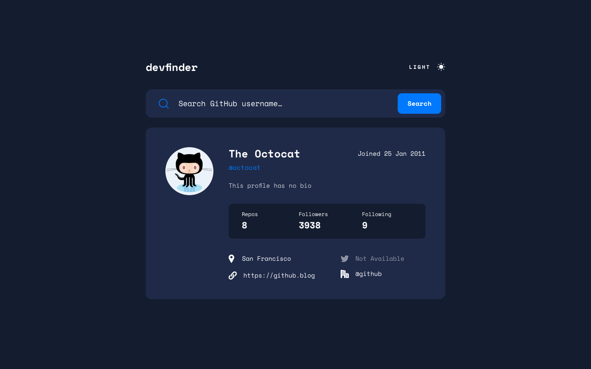

### GitHub User Search App

# Table of contents

- [Overview](#overview)
  - [The challenge](#the-challenge)
  - [Screenshot](#screenshot)
  - [Links](#links)
- [My process](#my-process)
  - [Built with](#built-with)
- [Author](#author)

# Overview

## The challenge

Users should be able to:

- View the optimal layout for the app depending on their device's screen size
- See hover states for all interactive elements on the page
- Search for GitHub users by their username
- See relevant user information based on their search
- Switch between light and dark themes
- Have the correct color scheme chosen for them based on their computer preferences.

# Screenshot

# Links

- [Solution URL](https://github.com/adetutudeborah/github-user-search-app)
- [Live site URL](https://github-user-search-app-adetutudeborah.vercel.app/)

# My process

## Built with

- HTML5 markup
- CSS custom properties
- Flexbox
- JavaScript

# Deployment
The GitHub User Search App has been deployed on `Vercel`, and it can be accessed at the following URL: https://github-user-search-app-adetutudeborah.vercel.app/

# Author

- GitHub - [@adetutudeborah](https://github.com/adetutudeborah)
- Twitter - [@adetutuoluwa](https://twitter.com/adetutuoluwa2)

